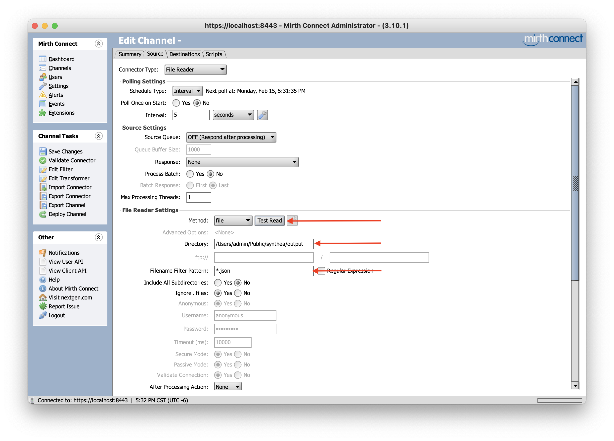

# How To Use NextGen (Mirth) Connect To Create A MongoDB Destination

### **Objective:** 
Load a FHIR JSON object into a MongoDB database collection, using the NextGen (Mirth) Connect Integration Engine. 

### **Prerequisites:**
1. [MongoDB v 4.4.3](https://www.mongodb.com/try/download/community) - Community Edition of the MoongoDB Database
2. [MongoDB Compass v 1.21.2](https://www.mongodb.com/try/download/compass) - Community Edition of the MongoDB GUI Client
3. Java 1.8 - Runtime Environment for Mirth
4. [NextGen (Mirth) Connect v 3.10](https://www.nextgen.com/products-and-services/nextgen-connect-integration-engine-downloads) - Full Suite including the Mirth GUI Client
5. [MongoDB Java Driver](https://mongodb.github.io/mongo-java-driver/)  (mongo-java-driver-3.12.7.jar)

Ensure the first *four* prerequisites are correctly installed on your system and running without errors.

Both MongoDB and Mirth can be run as a stand alone applications or as an OS service. For this example, we are running both as *Services*.

By default, Mirth wants to be installed with elevated privileges. This may require some of these steps to be performed with `sudo` on *nix environments or as `Administrator` on MS Windows platforms. On Mac OS you may need to run the Mirth package installer (`.dmg`) from a [root user account](https://support.apple.com/en-us/HT204012).

---

## Step 1 - Java driver setup

Copy the `mongo-java-driver-3.12.7.jar` into a subdirectory inside the Mirth installation directory called `custom-lib/`. On my Mac this is `/Applications/Mirth Connect/custom-lib/`.

Inside the Mirth install directory, use a text editor to add an entry to the bottom of `conf/dbdrivers.xml` (but inside the closing `</drivers>` tag).

    <driver class"org.mongodb.Driver" name="MongoDB" template="mongodb://localhost:27017/" selectLimit="db.synthea.find( {} )" />

Restart the Mirth service with `./mcservice restart`. 

This completes the pre-requisite *plumbing* for the Mirth drivers. If you observe any errors up to this point, fix these before proceeding.

---

## Step 2 - Configure a Source Connector to read a JSON file

Start the Mirth GUI client. 

You may need to login with the default Mirth credentials (username `admin` and password `admin`).

From the Channel Tasks nav pane select `New Channel`.

This will open the Channel Editor. Enter a useful channel name then select the `Source` tab. This will open the Source Editor where you will need to select and configure a Source Connector.

 Select a `File Reader` type which will allow us to open and read a `.json` file from disk.

Specify the path to the folder containing the json data file. In this example it is a FHIR compliant json object in a file called `Avalina.json`

Finally, hit the `Test Read` button and ensure your file is readable.

If you run into errors, resolve these before proceeding. They're most likely due to folder and file read permissions.

This concludes the config for inbound messages.

---

## Step 3 - Configure a Destination Channel Connector to write to MongoDB

Select the `Destination` tab and choose a Connector Type of `Javascript Writer`.

You can double click the Destination name and rename it to something more useful like `mongodb`.

Next, select the `Edit Transformer` option from the Channel Tasks nav panel. This will open the Transformer screen.

Create a `New Step` (1) and give it a name (2). In our example we'll call it `InboundMsg`.

 Assign `msg` to the `Mapping` and `Default Value` fields (3 & 4). The `msg` variable is a special reserved variable containing the transformed version of the data/message from the Source Connector.

Finally select `Back to Channel` (5) to return to the `Edit Channel` screen.

Enter the following javascript and note the use of our `InboundMsg` variable.

Check the mongodb connection string on line 1. In this example mongodb is running on our localhost and listening on the default port 27017.

Enter your Mongodb database and collection names on lines 2 & 3. In this example we'll be writing to a databases called `synthea` and a collection called `patients`.

    var mongoClient = new Packages.com.mongodb.MongoClient("localhost", 27017);
    var database = mongoClient.getDatabase("synthea");
    var collection = database.getCollection("patients");
    var jsonDoc = JSON.stringify($('InboundMsg'));
    var doc = new Packages.org.bson.Document.parse(jsonDoc);
    collection.insertOne(doc);
    var results = collection.find().first();
    logger.debug(JSON.stringify(results));
    mongoClient.close();
    return;

Finally, select `Deploy Channel` which will return you to the Mirth Dashboard.

At the Mirth Dashboard double click the destination channel.

Inspect the `Response` message.

If you see errors, select `Channels` from the Mirth Connect nav bar. Then double click your channel (or `Edit Channel` from the nav bar). Select `Set Data Types` to verify the internal message formats Mirth is passing from source connector to destination connector.

Make sure Mirth is using `JSON` from Source to Destination.

If you make any changes, select `OK` and then `Deploy` the channel again and nspect the `Response` messages again (per previous step).

If you are observing errors, check you are using the same versions as described in the *Prerequisites* section above. In testing, other version conbinations produced anomolous results at this Step.

This concludes configuration of the destination channel connector.  

---

## Step 4 - Verifying the data in MonogoDB.

Open MongoDB Compass GUI Client.

If you are unsure how to configure the connection string select `Fill in connection fields individually`

For a new install of mongodb, the default settings are sufficient.

Once connected to the `mongod` service you should see the database (`synthea`) and collection (`patients`) created by Mirth in Step 3.

Clicking on these you should be able to inspect the FHIR JSON objects.

This concludes the data validation at the final destination.

---

## Errors and Problems

If you have problems, [Stackoverflow has an active section](https://stackoverflow.com/questions/tagged/mirth) if you search with the tag `[mirth]`.

Also search the [Mirth Project Forums](https://forums.mirthproject.io/forum/mirth-connect/support). These community forums are less active but have some helpful code samples.

You can also try the [GitHub Issues](https://github.com/nextgenhealthcare/connect) section to see if you're facing a known problem.

Finally, if you're desperate there is the [Confluence Community Wiki](http://www.mirthcorp.com/community/wiki/dashboard.action). 

